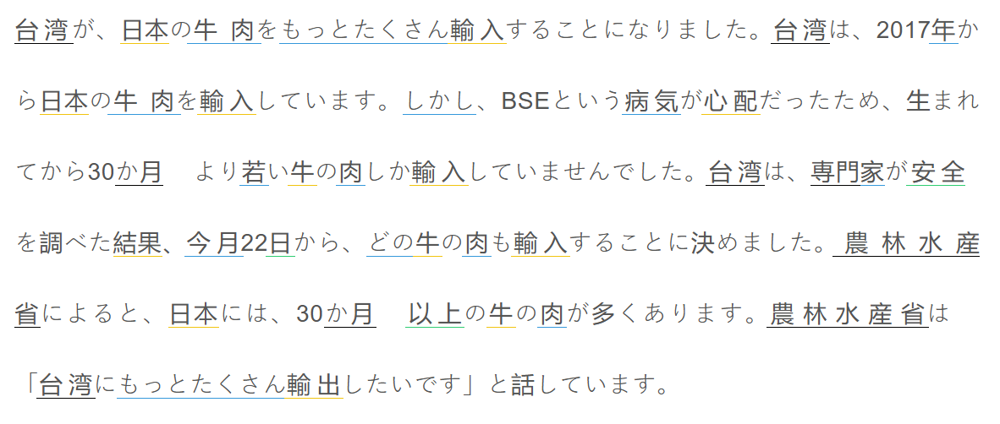

# Invoices_LLM

BAML + LLM

## 1. Install Necessary Libraries

```bash
    conda create -n ocr_baml python=3.10.12
    pip install -r requirements.txt
```

## 2. Generator Baml

```bash
    baml-cli generate
```

## 3. Run Programming

Create .env file and write GOOGLE_API_KEY="Your_api_key" or export GOOGLE_API_KEY = "Your_api_key"

### With Windows:

```bash
    python engine.py
```

### With MacOS/Linux:

#### 1. Run Python

```bash
    python engine.py
```

#### 2. Shell

```bash
    bash .\run.sh 
```

## 4. Result

### 4.1. Extract information about purchase time and amount paid

Input: 


Output:

```
[{'file_name': '3.png', 'extract_data': {'datetime': '07/10/2019', 'products': {'product_name': ['Suon bo ham', 'Banh my ca moi pate', 'Bo thap cam hap', 'Banh bot dau xanh ran thit', 'Cafe nau da', 'Cocacola', 'Banh my ca moi thit nguoi'], 'product_quantity': ['2', '1', '1', '1', '1', 
'1', '1'], 'product_unit_price': ['60,000.00', '45,000.00', '50,000.00', '40,000.00', '32,000.00', '10,000.00', '45,000.00'], 'product_price': ['120,000.00', '45,000.00', '50,000.00', '40,000.00', '32,000.00', '10,000.00', '45,000.00']}, 'total': '342,000.00'}, 'tokens': [1975, 398]}]
```

### 4.2. Extract text content and determine the level of the article 

Input:



Output:

```
[{'file_name': 'Japanese.png', 'extract_data': {'title': '台湾が日本産牛肉の輸入を拡大', 'content': '台湾が、日本の牛肉をもっとたくさん輸入することになり
ました。台湾は、2017年から日本の牛肉を輸入しています。しかし、BSEという病気が心配だったため、生まれてから30か月より若い牛の肉しか輸入していませんでした。台湾は、専門 
家が安全を調べた結果、今月22日から、どの牛の肉も輸入することに決めました。農林水産省によると、日本には、30か月以上の牛の肉が多くあります。農林水産省は「台湾にもっとた
くさん輸出したいです」と話しています。', 'language': 'ja', 'level': 'N3'}, 'tokens': [2486, 179]}]
```